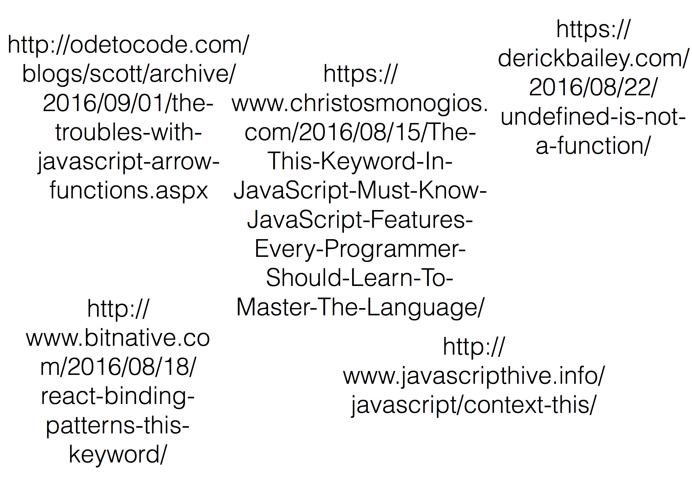
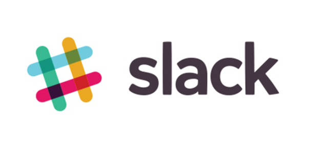
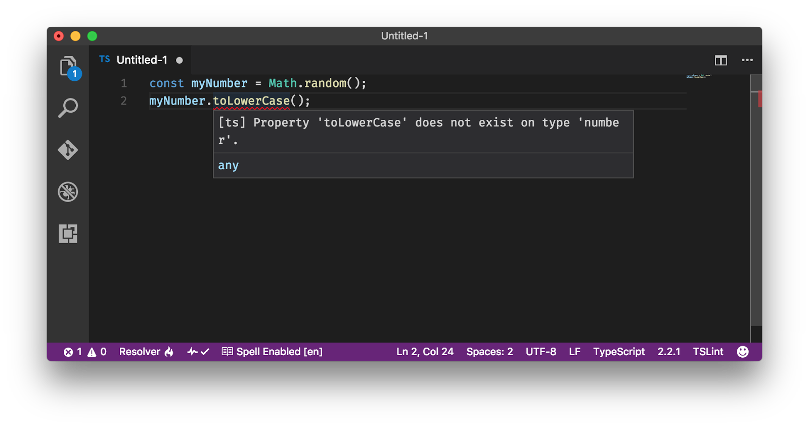
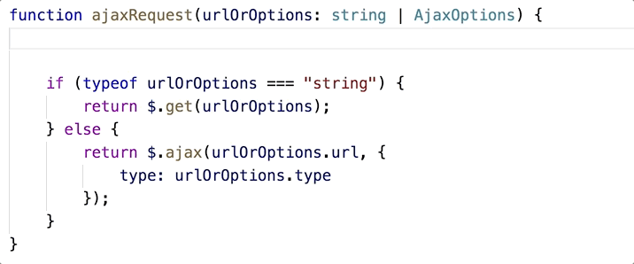
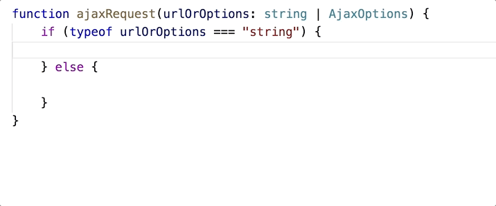
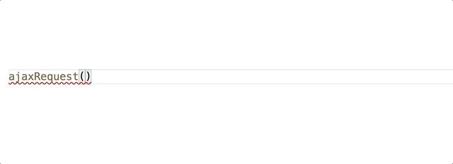

# Your <span class="orange">JavaScript</span> Needs <span class="orange">Types</span>

### @schneidenbach

---


---


---


---


---


---


---

Let's start with the
# ONE <span class="orange">inalienable truth</span>

---

# JAVASCRIPT IS <span class="orange">WEIRD</span>.

---

```javascript
var customer = repo.getCustomer(id);
var orders = customer.getOrders();
```

---

```javascript
var customer = repo.getCustomer(id);
var orders = customer.getOrderes();
```

---

```javascript
var customer = repo.getCustomer(id);
var orders = customer.getHorDoeuvres();
```

---

# `this`

---



---

```javascript
window.WhoAmI = "I'm the window object";

function Test() {
  this.WhoAmI = "I'm the Test object";
}

var t = Test();
```

---

```javascript
window.WhoAmI = "I'm the window object";

function Test() {
  this.WhoAmI = "I'm the Test object";
}

var t = Test();
alert(window.WhoAmI);   // I'm the Test object
alert(t.WhoAmI);        // t is undefined
```

---

```javascript
window.WhoAmI = "I'm the window object";

function Test() {
  this.WhoAmI = "I'm the Test object";
}

var t = new Test();
alert(window.WhoAmI);   // I'm the window object
alert(t.WhoAmI);        // I'm the Test object
```

---

###  `typeof`

Code | Returns
---- | ------
`typeof undefined` | `"undefined"`
`typeof null` | `"object"`

---


---

# JAVASCRIPT IS <span class="orange">WEIRD</span>.

---

So how can we make the weird <span class="orange">less weird</span>?

---

### Most important things you can do:

---

### <span class="orange">Most important things you can do:</span>  
understand JavaScript completely

---

### <span class="orange">Most important things you can do:</span>  
be perfect 100% of the time

---

### <span class="orange">Most important things you can do:</span>  
write tests

---

### <span class="orange">Most important things you can do:</span>  
understand JavaScript completely  
be perfect 100% of the time  
write tests

---

### <span class="orange">Most important things you can do:</span>  
understand JavaScript completely  
be perfect 100% of the time  
write tests

# THIS IS HARD.

---

Number two thing you can do:

---

Number two thing you can do:  
<span class="orange">use a type system</span>

---

## Type Systems

---

<span class="orange">Type systems</span> are all about adding <span class="orange">certainty</span>

---

<span class="orange">Type systems</span> are all about adding <span class="orange">certainty</span>  
(As .NET folks we can definitely understand this)

---

<span class="orange">Type systems</span> are all about adding <span class="orange">certainty</span>  
(As .NET folks we can definitely understand this)  

(...unless we use VB.NET with Option Strict Off)

---

## <span class="orange">Advantages of type systems</span>

1. Safety
2. Tooling
3. Self-documenting code

---

## But don't take my word for it

---


---

## Reddit
Wanted a language with a type system

---

## Reddit
### Types
serve as <span class="orange">documentation at the micro-level</span>

[source](https://redditblog.com/2017/06/30/why-we-chose-typescript/)

---

## Reddit
### Types
help ensure <span class="orange">correctness</span>

[source](https://redditblog.com/2017/06/30/why-we-chose-typescript/)

---

## Reddit
### Types
makes <span class="orange">refactoring code less stressful</span>

[source](https://redditblog.com/2017/06/30/why-we-chose-typescript/)

---

### For example

```typescript
interface Person {
    firstName: string;
    lastName: string;
    age?: number;
}
```

---

### For example

```typescript
interface Person {
    firstName: string;
    lastName: string;
    age?: number;
}

let amy: Person = {
    firstName: "Amy",
    lastName: "George"
};

let michael: Person = {
    firstName: "Michael",
    lastName: "Turner",
    age: 45
};
```

---

## Reddit
Another consideration was the <span class="orange">speed of development</span> 

[source](https://redditblog.com/2017/06/30/why-we-chose-typescript/)

---

## Reddit
We wanted to add types because we <span class="orange">wanted to move quickly</span>

[source](https://redditblog.com/2017/06/30/why-we-chose-typescript/)

---

## Reddit
> This sounds a bit antithetical to how many people view types, in that it adds overhead to development and therefore slows developers down. <span class="orange">However, in moving quickly, it is much easier to introduce bugs.</span>

[source](https://redditblog.com/2017/06/30/why-we-chose-typescript/)

---

## The result?

our code has <span class="orange">fewer type-related bugs</span>

[source](https://redditblog.com/2017/06/30/why-we-chose-typescript/)

---

## The result?

we are more <span class="orange">confident making large refactors</span>

[source](https://redditblog.com/2017/06/30/why-we-chose-typescript/)

---

## The result?

<span class="orange">our inline documentation is focused around concepts</span> instead of object shapes and function parameters

[source](https://redditblog.com/2017/06/30/why-we-chose-typescript/)

---



---

## How about Slack?

we were surprised by the <span class="orange">number of small bugs we found</span> when converting our code

[source](https://slack.engineering/typescript-at-slack-a81307fa288d)

---

## How about Slack?

> <span class="orange">the more lines of code a human writes</span>, the more inevitable it becomes to:  
misspell a property

[source](https://slack.engineering/typescript-at-slack-a81307fa288d)

---

## How about Slack?

> <span class="orange">the more lines of code a human writes</span>, the more inevitable it becomes to:  
assume the parent of a nested object to always exist

[source](https://slack.engineering/typescript-at-slack-a81307fa288d)

---

## How about Slack?

> <span class="orange">the more lines of code a human writes</span>, the more inevitable it becomes to:  
use a non-standard error object

[source](https://slack.engineering/typescript-at-slack-a81307fa288d)

---

## Slack

Second, we underestimated how <span class="orange">powerful the editor integration</span> is

[source](https://slack.engineering/typescript-at-slack-a81307fa288d)

---

## Slack

<span class="orange">TypeScript understands which properties and methods are available on certain objects</span>, enabling your editor to do the same.

[source](https://slack.engineering/typescript-at-slack-a81307fa288d)

---

###  Union types

```typescript
interface AjaxOptions {
    url: string;
    type: string;
}

function ajaxRequest(urlOrOptions: string | AjaxOptions) {}
```

---

###  Union types

```typescript
interface AjaxOptions {
    url: string;
    type: string;
}

function ajaxRequest(urlOrOptions: string | AjaxOptions) {
    if (typeof urlOrOptions === "string") {
        return $.get(urlOrOptions);
    } else {
        return $.ajax(urlOrOptions.url, {
            type: urlOrOptions.type
        });
    }
}

```

---

## I love this line

> An autocomplete system that only uses words in the current document <span class="orange">feels barbaric</span> afterward.

[source](https://slack.engineering/typescript-at-slack-a81307fa288d)

---

## <span class="orange">Advantages of type systems</span>

1. Safety
2. Tooling
3. Self-documenting code

---

## Examples of safety:
- Variable declaration
- Interfaces
- Generics
- Either-or (union) types
- Combining (intersection) types

---

###  Variables

Variables and functions will be given types where possible

```typescript
let aNumber = 42;   //aNumber is inferred to be type 'number'
```

If you mix types, TypeScript/Flow will show an error

```typescript
let aNumber: number = 42;
aNumber = "forty two";  //Error: aNumber is of type number
```

---

###  Interfaces define structure

The "shape" of the object is what counts

```typescript
interface Person {
    firstName: string;
    lastName: string;
}

function addPerson(newPerson: Person) {
    //do some stuff
}

addPerson({
    firstName: "John",
    lastName: "Lackey"
});     //totally valid

```

---

###  Generics

Allows you to define reusable constraints on types

```typescript
let thePersons: Array<Person> = [];

thePersons.push({
    firstName: "John",
    lastName: "Lackey"
});

thePersons.push("John Lackey");     //error

```

---

### Intersection types

```typescript
interface Dog { breed: string; }
interface Dinosaur { hasSharpTeeth: boolean; }

let dog: Dog = { breed: "Poodle" };
let velociraptor: Dinosaur = { hasSharpTeeth: true };

let abomination = extend({}, dog, velociraptor);

console.log(abomination.breed);         //valid!
console.log(abomination.hasSharpTeeth); //valid!
```

---

## Tooling

* Squigglies
* Intellisense
* Refactoring

---

## Squiggles



---

## Intellisense



---

## Intellisense



---

### Type Definitions in TypeScript

`npm install @types/jquery`

---

## Refactoring


---

## Self-documenting code

```typescript
type HttpRequestType = "GET" | "POST" | "PUT";

interface AjaxOptions {
    url: string;
    type: HttpRequestType;
}

function ajaxRequest(urlOrOptions: string | AjaxOptions) {}
```

---

## Not self-documenting code

```typescript
function ajaxRequest(urlOrOptions) {}
```

---

## Self-documenting code

```typescript
type HttpRequestType = "GET" | "POST" | "PUT";

interface AjaxOptions {
    url: string;
    type: HttpRequestType;
}

function ajaxRequest(urlOrOptions: string | AjaxOptions) {}
```

--- 



---

### Types add <span class="orange">meaning</span> to your code

---

Ok, so you want to use a type system.  <span class="orange">Which one</span>?

---

### <span class="orange">Flow</span>
Is a checker, not a language  
You need to remove the type annotations using some kind of build step - babel is a good example  
Better type inference

---

### In TypeScript, this subtly breaks

```typescript
function operate(num1: number, num2: number, op: string) {
    if (op === "add") {
        return num1 + num2;
    }
}

let result = operate(4, 1, "subtract");
//result: undefined
```

---

### In TypeScript, this subtly breaks

```typescript
function operate(num1: number, num2: number, op: string) {
    if (op === "add") {
        return num1 + num2;
    }
}

let result = operate(4, 1, "subtract");
//result: undefined

result.toString(); //blows up
```

---

### In Flow, return type correctly interpreted

```typescript
function operate(num1: number, num2: number, op: string) {
    if (op === "add") {
        return num1 + num2;
    }
}

let result = operate(4, 1, "subtract");
result.toString();  //error!
```

---

### Way around: use type annotation on function

```typescript
function operate(num1: number, num2: number, op: string): number {
    if (op === "add") {
        return num1 + num2;
    }
    //ERROR: return missing
}

```

---

## <span class="orange">TypeScript</span>
excellent community support  
excellent tooling  
Has modern language features  
More turnkey for .NET folks

---

## <span class="orange">Confession</span> time

---

## <span class="orange">Challenges</span>

---

## <span class="orange">Advantages</span> of type systems

1. Safety
2. Tooling
3. Self-documenting code

---

## <span class="orange">Disadvantages</span>

* Yet Another Language to Learn
* Altered workflow
* You aren't taking advantage of JavaScript's best part: it pretend like it's gonna work

---

## <span class="orange">Disadvantages</span>

* Yet Another Language to Learn
* Altered workflow
* You aren't taking advantage of JavaScript's best part: it pretend like it's gonna work (just kidding)

---

## Criteria for choosing

Does your javascript need types if you're doing a small project? <span class="orange">**probably not**</span>  
Does your javascript need types if you're adding an animation to a WebForms page stuck in a script tag? <span class="orange">**no**</span>  
Is the JS code base large? <span class="orange">**yes**</span>  
Do you need to refactor often? <span class="orange">**YES**</span>

---

## Getting Started

typescriptlang.org  
flow.org

---

# <span class="orange">Questions?</span>

---

## Thank you!

[@schneidenbach](https://twitter.com/schneidenbach)  
schneids.net