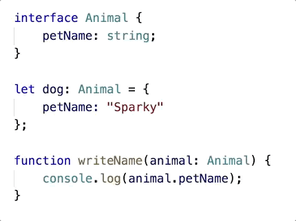

# Your JavaScript Needs Types

### @schneidenbach

---


---


---


---


---


---

Let's start with the
# ONE inalienable truth

---

# JAVASCRIPT IS WEIRD.

---

```javascript
var customer = repo.getCustomer(id);
var orders = customer.getOrders();
```

---

```javascript
var customer = repo.getCustomer(id);
var orders = customer.getOrderes();
```

---

```javascript
var customer = repo.getCustomer(id);
var orders = customer.getHorDoeuvres();
```

---

# `this`

---


---

```javascript
window.WhoAmI = "I'm the window object";

function Test() {
  this.WhoAmI = "I'm the Test object";
}

var t = Test();
```

---

```javascript
window.WhoAmI = "I'm the window object";

function Test() {
  this.WhoAmI = "I'm the Test object";
}

var t = Test();
alert(window.WhoAmI);   // I'm the Test object
alert(t.WhoAmI);        // t is undefined
```

---

```javascript
window.WhoAmI = "I'm the window object";

function Test() {
  this.WhoAmI = "I'm the Test object";
}

var t = new Test();
alert(window.WhoAmI);   // I'm the window object
alert(t.WhoAmI);        // I'm the Test object
```

---

###  `typeof`

Code | Returns
---- | ------
`typeof undefined` | `"undefined"`
`typeof null` | `"object"`

---


---

# JAVASCRIPT IS WEIRD.

---

So how can we make the weird less weird?

---

Number one thing you can do:

---

Number one thing you can do:<br>
<span class="orange">understand JavaScript</span>

---

Number one thing you can do:  
<span class="orange">understand JavaScript</span>

# THIS IS HARD.

---

Number two thing you can do:

---

Number two thing you can do:  
<span class="orange">use a type system</span>

---

## Type Systems

---

<span class="orange">Type systems</span> are all about adding certainty

---

<span class="orange">Type systems</span> are all about adding certainty  
(As .NET folks we can definitely understand this)

---

<span class="orange">Type systems</span> are all about adding certainty  
(As .NET folks we can definitely understand this)  

(...unless we use VB.NET with Option Strict Off)

---

## Advantages of type systems

1. Safety
2. Tooling
3. Self-documenting code

---

## But don't take my word for it

---


---

## Reddit
Wanted a language with a type system
> Types **serve as documentation at the micro-level**, help ensure correctness (to a certain degree), and most importantly, make refactoring code less stressful.

[source](https://redditblog.com/2017/06/30/why-we-chose-typescript/)

---

## Reddit
Wanted a language with a type system
> Types serve as documentation at the micro-level, **help ensure correctness (to a certain degree)**, and most importantly, make refactoring code less stressful.

[source](https://redditblog.com/2017/06/30/why-we-chose-typescript/)

---

## Reddit
Wanted a language with a type system
> Types serve as documentation at the micro-level, help ensure correctness (to a certain degree), and most importantly, make **refactoring code less stressful**.

[source](https://redditblog.com/2017/06/30/why-we-chose-typescript/)

---

### For example

```typescript
interface Person {
    firstName: string;
    lastName: string;
    age?: number;
}
```

---

### For example

```typescript
interface Person {
    firstName: string;
    lastName: string;
    age?: number;
}

let amy: Person = {
    firstName: "Amy",
    lastName: "George"
};

let michael: Person = {
    firstName: "Michael",
    lastName: "Turner",
    age: 45
};
```

---

## Reddit
> **Another consideration was the speed of development.** We wanted to add types because we wanted to move quickly. 

[source](https://redditblog.com/2017/06/30/why-we-chose-typescript/)

---

## Reddit
> This sounds a bit antithetical to how many people view types, in that it adds overhead to development and therefore slows developers down. **However, in moving quickly, it is much easier to introduce bugs.**

[source](https://redditblog.com/2017/06/30/why-we-chose-typescript/)

---

## The result?

> Using a typed language in our frontend has already paid dividends: our **code has fewer type-related bugs**, we are more confident making large refactors, and our inline documentation is focused around concepts instead of object shapes and function parameters. 

[source](https://redditblog.com/2017/06/30/why-we-chose-typescript/)

---

## The result?

> Using a typed language in our frontend has already paid dividends: our code has fewer type-related bugs, **we are more confident making large refactors**, and our inline documentation is focused around concepts instead of object shapes and function parameters. 

[source](https://redditblog.com/2017/06/30/why-we-chose-typescript/)

---

## The result?

> Using a typed language in our frontend has already paid dividends: our code has fewer type-related bugs, we are more confident making large refactors, and **our inline documentation is focused around concepts** instead of object shapes and function parameters. 

[source](https://redditblog.com/2017/06/30/why-we-chose-typescript/)

---


---

## How about Slack?

> First, we were **surprised by the number of small bugs we found when converting our code**... **the more lines of code a human writes**, the more inevitable it becomes to misspell a property, assume the parent of a nested object to always exist, or to use a non-standard error object.

[source](https://slack.engineering/typescript-at-slack-a81307fa288d)

---

## Slack

> Second, we **underestimated how powerful the editor integration is**... TypeScript understands which properties and methods are available on certain objects, enabling your editor to do the same.

[source](https://slack.engineering/typescript-at-slack-a81307fa288d)

---

###  Union types

```typescript
interface AjaxOptions {
    url: string;
    type: string;
}

function ajaxRequest(urlOrOptions: string | AjaxOptions) {}
```

---

###  Union types

```typescript
interface AjaxOptions {
    url: string;
    type: string;
}

function ajaxRequest(urlOrOptions: string | AjaxOptions) {
    if (typeof urlOrOptions === "string") {
        return $.get(urlOrOptions);
    } else {
        return $.ajax(urlOrOptions.url, {
            type: urlOrOptions.type
        });
    }
}

```

---

## I love this line

> An autocomplete system that only uses words in the current document feels barbaric afterward.

[source](https://slack.engineering/typescript-at-slack-a81307fa288d)

---

## Advantages of type systems

1. Safety
2. Tooling
3. Self-documenting code

---

## Examples of safety:
- Variable declaration
- Interfaces
- Generics
- Either-or (union) types
- Combining (intersection) types

---

###  Variables

Variables and functions will be given types where possible

```typescript
let aNumber = 42;   //aNumber is inferred to be type 'number'
```

If you mix types, TypeScript/Flow will show an error

```typescript
let aNumber: number = 42;
aNumber = "forty two";  //Error: aNumber is of type number
```

---

###  Interfaces define structure

The "shape" of the object is what counts

```typescript
interface Person {
    firstName: string;
    lastName: string;
}

function addPerson(newPerson: Person) {
    //do some stuff
}

addPerson({
    firstName: "John",
    lastName: "Lackey"
});     //totally valid

```

---

###  Generics

Allows you to define reusable constraints on types

```typescript
let thePersons: Array<Person> = [];

thePersons.push({
    firstName: "John",
    lastName: "Lackey"
});

thePersons.push("John Lackey");     //error

```

---

### Intersection types

```typescript
interface Dog { breed: string; }
interface Dinosaur { hasSharpTeeth: boolean; }

let dog: Dog = { breed: "Poodle" };
let velociraptor: Dinosaur = { hasSharpTeeth: true };

let abomination = extend({}, dog, velociraptor);

console.log(abomination.breed);         //valid!
console.log(abomination.hasSharpTeeth); //valid!
```

---

## Tooling

* Squigglies
* Intellisense
* Refactoring

---

## Squiggles


---

## Intellisense


---

## Intellisense


---

## Type Definitions in TypeScript

`npm install @types/jquery`

---

## Refactoring



---

## Self-documenting code

```typescript
type HttpRequestType = "GET" | "POST" | "PUT";

interface AjaxOptions {
    url: string;
    type: HttpRequestType;
}

function ajaxRequest(urlOrOptions: string | AjaxOptions) {}
```

---

## Not self-documenting code

```typescript
function ajaxRequest(urlOrOptions) {}
```

---

## Self-documenting code

```typescript
type HttpRequestType = "GET" | "POST" | "PUT";

interface AjaxOptions {
    url: string;
    type: HttpRequestType;
}

function ajaxRequest(urlOrOptions: string | AjaxOptions) {}
```

--- 


---

## Types add meaning to your code

---

Ok, so you want to use a type system.  Which one?

---

## Flow
Is a checker, not a language  
You need to remove the type annotations using some kind of build step - babel is a good example  
Better type inference

---

## In TypeScript, this subtly breaks

```typescript
function operate(num1: number, num2: number, op: string) {
    if (op === "add") {
        return num1 + num2;
    }
}

let result = operate(4, 1, "subtract");
//result: undefined
```

---

## In TypeScript, this subtly breaks

```typescript
function operate(num1: number, num2: number, op: string) {
    if (op === "add") {
        return num1 + num2;
    }
}

let result = operate(4, 1, "subtract");
//result: undefined

result.toString(); //blows up
```

---

## In Flow, return type correctly interpreted

```typescript
function operate(num1: number, num2: number, op: string) {
    if (op === "add") {
        return num1 + num2;
    }
}

let result = operate(4, 1, "subtract");
result.toString();  //error!
```

---

## Way around: use type on function

```typescript
function operate(num1: number, num2: number, op: string): number {
    if (op === "add") {
        return num1 + num2;
    }
    //ERROR: return missing
}

```

---

## TypeScript
excellent community support  
excellent tooling  
Has modern language features  
More turnkey for .NET folks

---

## Confession time

---

## Let's take you through some of the challenges

---

## Advantages of type systems

1. Safety
2. Tooling
3. Self-documenting code

---

## Disadvantages

* Yet Another Language to Learn
* Altered workflow
* You aren't taking advantage of JavaScript's best part: it pretend like it's gonna work

---

## Disadvantages

* Yet Another Language to Learn
* Altered Workflow
* You aren't taking advantage of JavaScript's best part: it pretend like it's gonna work (just kidding)

---

## Criteria for choosing

Does your javascript need types if you're doing a small project? **probably not**  
Does your javascript need types if you're adding an animation to a WebForms page stuck in a script tag? **no**  
Is the JS code base large? **yes**  
Do you need to refactor often? **YES**
---
# Questions?